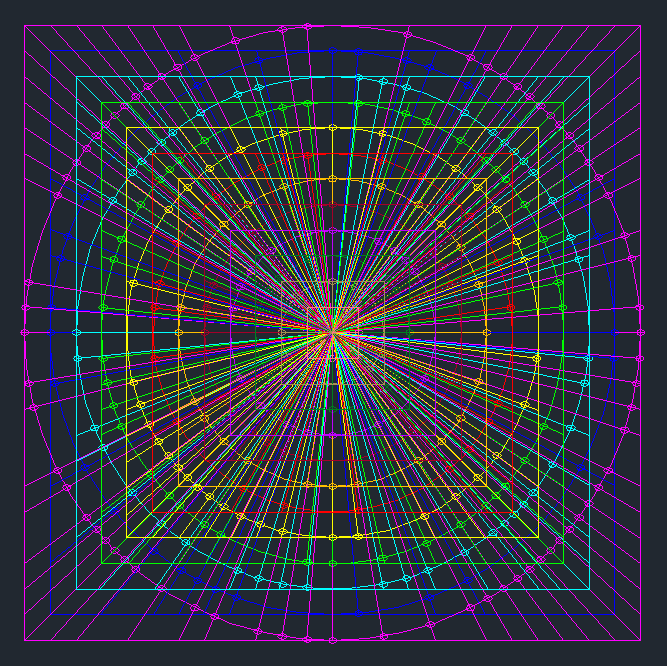
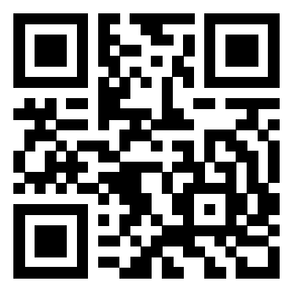

# 13 - Sagittarius...

... is playing with his pila again.

Can you find the Easter egg QR code he has hidden from you?

[pila.kmz](files/pila.kmz)

### Solution

The challenge picture displayed *Sagittarius* without his bow and there was a ball instead of *Corona Australis*. Another hint?

I started with simple lesson of Latin:
* *sagittarius* is an archer
* *pila* is a ball

Then I looked at the KMZ file:

*KMZ is a file extension for a placemark file used by Google Earth. It stands for Keyhole Markup language Zipped. It is a compressed version of a KML (Keyhole Markup Language) file.*

I opened the KMZ file online using [this site](http://www.gpsvisualizer.com) and saved it in SVG format. I played a bit with the SVG image to make it better arranged.


It looked like an elliptic version of a QR code. The positioning markings were clearly visible. Great!

It was pretty straightforward so far. Now I had to figure out how to "square" it. Although it seemed like an easy task, it was a bit more complicated to implement than I originally thought. I ended up with this not very clear drawing made in Autocad.



Each color represented the projection of one ellipse (already stretched to a circle) to its square. Each point located originally on the ellipse was projected onto the intersection of the square with a line drawn from the center passing through that point.

This gave me a square grid of 25x25 points. The last step was to replace the points with black squares on white background to get the QR code.



### Flag

```
he18-09jG-ie9k-Fdxv-QsNg
```