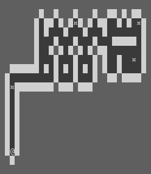
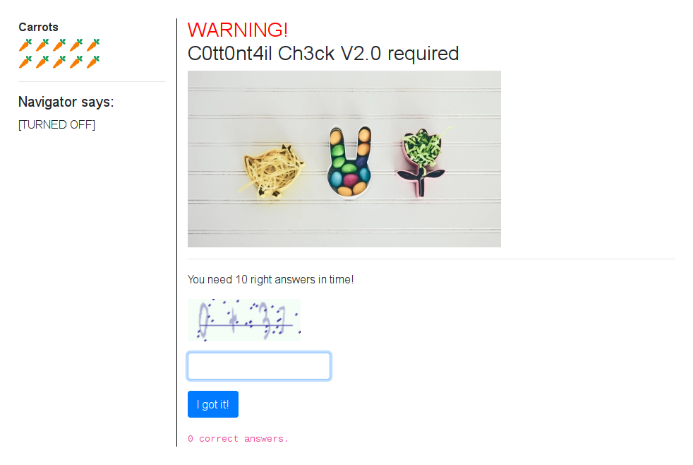
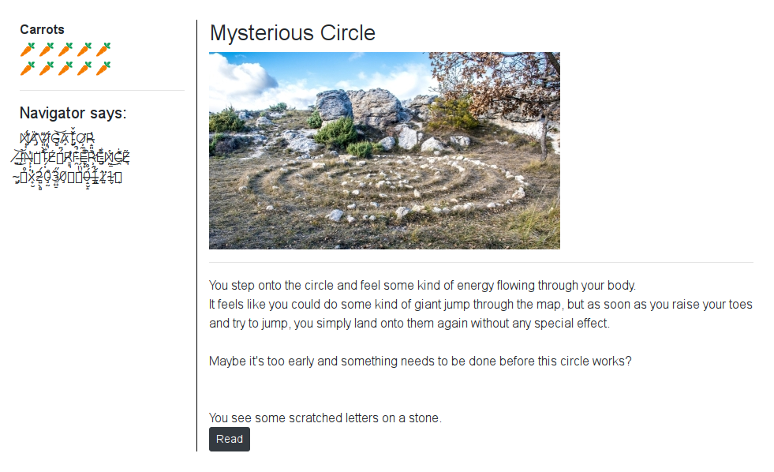
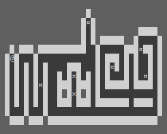
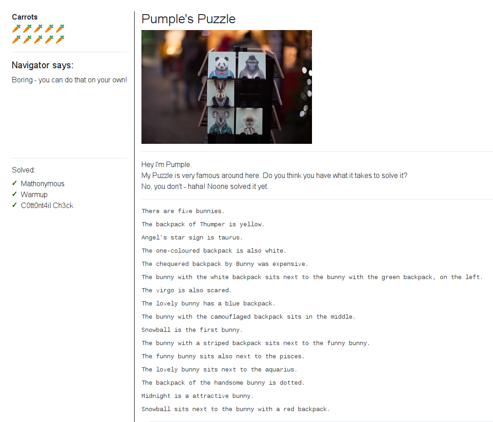
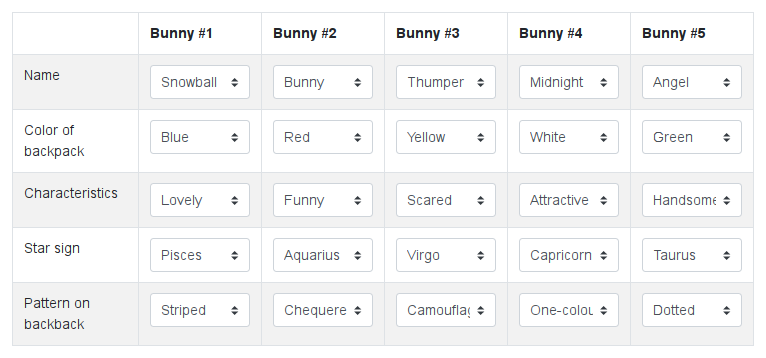
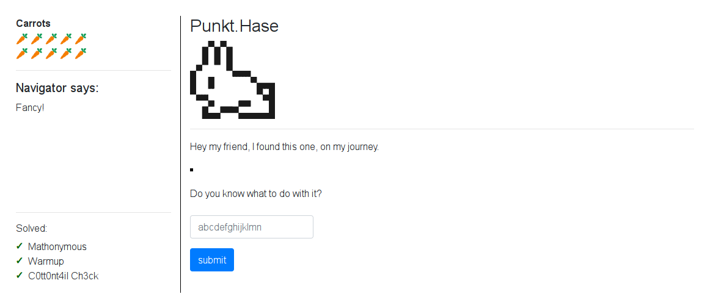
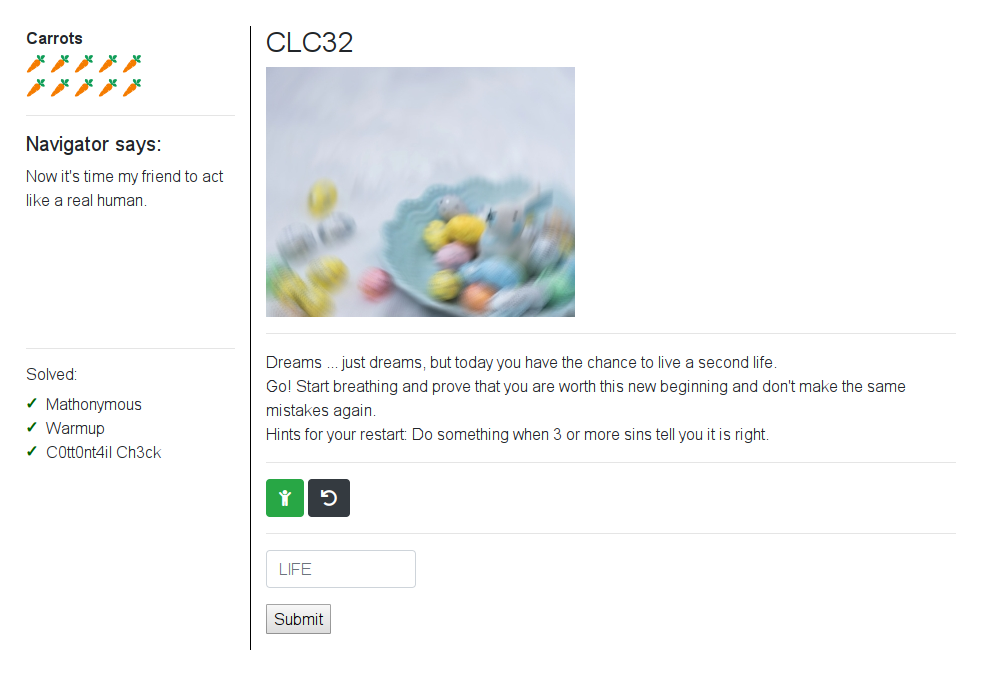
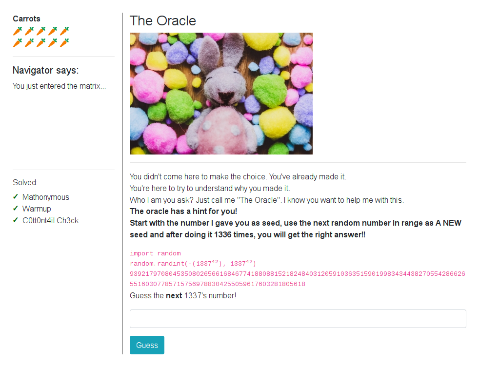
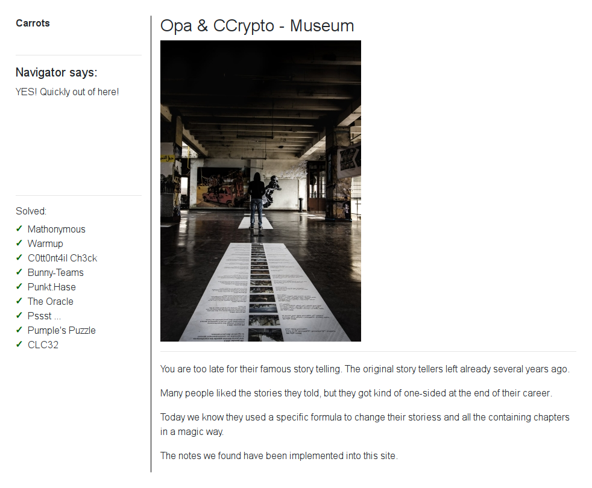

# 21 - The Hunt: Misty Jungle

Welcome to the longest scavenger hunt of the world!

The hunt is divided into two parts, each of which will give you an Easter egg. Part 1 is the **Misty Jungle**.

To get the Easter egg, you have to fight your way through a maze. On your journey, find and solve **8** mini challenges, then go to the exit. Make sure to check your carrot supply! Wrong submissions cost one carrot each.

[Start the hunt](http://whale.hacking-lab.com:5337/)

### Description

The target site provided me these simple instructions:

> *Click the buttons on the left to get some basic help.* 
>
> *What you are seeing is your navigator interface. This is the only option to interact with the environment. Since we are in an early stage of this new feature, we can't provide you any graphical interface right now. But you are smart (this is why you choosed us!) and will figure it out quickly.*
> 
> *You got it. What would be an exciting trip without the option to move and visit all the nice places we promised you?*
> 
> ``` ``bqq`vsm``0npwf0y0z ```
> 
> *You might meet other visitor during your travel. Some really take a lot of time in there to see our whole effort in detail.*
>  
> *But I promise - everyone is nice in there and will love to meet you! 😈*

### Solution

The first thing I had to do was to figure out how to move. The key was to decode the ``` ``bqq`vsm``0npwf0y0z ``` string. I displayed source code of the page and found this `script` element.

```html
<script type='text/javascript'>
    // add all this variables later
    let youCanTouchThis = "";
    let youCantTouchThis = "";
    let randomNumber = undefined;

    for (let i = 0; i < youCantTouchThis.length; i++) {
        if (youCantTouchThis.charCodeAt(i) === 28) {
            youCanTouchThis += '&';
        } else if (youCantTouchThis.charCodeAt(i) === 23) {
            youCanTouchThis += '!';
        } else {
            youCanTouchThis += String.fromCharCode(youCantTouchThis.charCodeAt(i) - randomNumber);
        }
    }
    // document.write(m);
</script>
``` 

I used it to decode the encoded hint which gave me `__app_url__/move/x/y` for `randomNumber` equal to 1.

To make things easier I wrote The Hunt Maze [client](../../src/main/scala/hackyeaster2019/tools/TheHuntMaze.scala) in Scala which I later reused for the second part of The Hunt: [Muddy Quagmire](../egg22/README.md). The whole application state was stored in the encrypted session cookie so I could restore any previous state using the `init` method. It was very useful feature.

I used the client to manually explore the maze to get a map with position of the mini challenges. This maze had two stages. You had to complete all the mini challenges in the first stage to unlock the second stage.

### Stage 1

Here is an ASCII version of the map of the first stage. Starting position is marked by `@` and position of the mini challenges by `¤` character.



#### Warmup


The two images looked the same but some of the pixels were different. You were supposed to find all `[x,y]` positions of those pixels. It was easy to write a [script](../../src/main/scala/hackyeaster2019/Egg21Warmup.scala) to do that, but the submit form did not validate the input so you could submit any string.

```scala
val dir = Paths.get("hackyeaster2019/challenges/egg21/files/warmup")

val left = ImageIO.read(dir.resolve("c11.png").toFile)
val right = ImageIO.read(dir.resolve("75687138-87d0-4c78-b2e3-f335acf76f15.png").toFile)

println(differences)

def differences: String = {
  assert(left.getWidth == right.getWidth && left.getHeight == right.getHeight)

  val pixels = for (x <- 0 until left.getWidth; y <- 0 until left.getHeight) yield (x, y)
  val differences = pixels.filter { case (x, y) => left.getRGB(x, y) != right.getRGB(x, y) }

  differences.map(t => s"[${t._1},${t._2}]").mkString("[", ", ", "]")
}
```

The result:

```
[[8,368], [37,95], [207,642], [252,55], [258,557], [278,49], [289,16], [353,315], [358,249], [418,29]]
```

#### Mathonymous 2.0


You had to find the right arithmetic operators to put in the blank boxes to make the math expression correct. To solve this challenge, I wrote a [script](../../src/main/scala/hackyeaster2019/Egg21Mathonymous.scala) to bruteforce the combination.

```scala
val toolbox = currentMirror.mkToolBox()

val ops = List("+", "-", "*", "/")
val solution = for {
  op1 <- ops; op2 <- ops; op3 <- ops; op4 <- ops; op5 <- ops
  if eval(s"11 $op1 18 $op2 15 $op3 18 $op4 13 $op5 4") == 84
} yield s"11 $op1 18 $op2 15 $op3 18 $op4 13 $op5 4 = 84"

println(solution)

def eval(expr: String): Int = {
  toolbox.eval(toolbox.parse(expr)).asInstanceOf[Int]
}
```

The result:

```
11 + 18 - 15 + 18 + 13 * 4 = 84
```

#### C0tt0nt4il Ch3ck V2.0



Here you had to solve a math expression captcha in time. I noticed that UUID-like format of the captcha image names contained the right answer in the third ID part.

For example: [bd1adcff-67ea-**124**-8edf-37663d12dc63.png](http://whale.hacking-lab.com:5337/static/img/ch12/challenges/bd1adcff-67ea-124-8edf-37663d12dc63.png) → 124

I wrote a simple jQuery script to extract the result and submit it.

```javascript
var result = $('#captcha').attr('src').split('-')[2];
$('input[type="text"]').val(result);
$('input[type="submit"]').click();
```

#### Mysterious Circle



This was just a teleport to the second stage of the maze. Once you completed all the mini challenges in this stage, navigator message changed to:

> S̶̡̛̛̰̠̩͇̯̮͌͌̈́̐͜o̷̘̼̘͍̅͊̊m̷̲̼̰̙͓̼̳̺̃̃̐̀̕ẹ̸̘͈̲͕̞̏͌͑͜t̶̠̱̀ͅh̵̨̛͎̘̠̗̥̣̱̠͉̓̂̋̈́́͗̕̚͠į̶̛͈̩͔̮͎͉̥͔́̋̇͊̾͋́̀̕n̶̺̈́̈́͑̅̾͊̕͘̕ĝ̷̩̲͓̥͉̤̯͇̐́̀͠͠ ̴̱̩̏̔̿̆̈́̿̌̌́̚s̶̮̽t̵̨̘̠̹̮̖̎̔̀͗̐̒̕r̴̢͚̠̘̪̤̺͓͒̋͒a̸̜̋̉̑̓͐̆̓̕n̴̡͚͚͉̦̫̻͋̌̇̊̒̔͜g̸͙̳̦̘̅͜e̴̛̮̹̰͔̬̖̞̱͎̭̿͌̋̂͠ ̶̰̮͔̯̩̩̲͇̃͗͌̈́̆̿̕̕h̷̢̨̢̢̞̪͆̎̉̽̆͗a̷̺̍̄̐̔̑͘̕p̷̨̝͙͇͙̫͖̌̌͂͋͛͐̌͘ͅp̵̧͖͈͌͆̔̑̇͂̈́͘e̸͍̫͇͗̈́̚n̵̡̧͎͉̦̫̽͗̔̀̍̋e̸̢̢̦̙̟͍͔̱̾̈͊͊͝d̷̰̺̟͕̝͋́́̈.̶̧̨̛͍̺̱͎͖̖̭̪̋̿̓̀͗̌̃͘ ̶̨̛͚̰̖͕͜Ȳ̶͈̻̤̥̗̔̊̚ò̶̤̩̝̗̘̗̾̒̾̂͠ú̷͍̩̲̯̟ ̷͇͔̰͍͙̖͖̙̈͗́̓̾s̷̡̨͖̩̹͉͜͠ȩ̸̢͙̰̳͌ĕ̵̪͋̔m̵̢̨̼͙̼͓̣̟͒̈̆̽̌̉͆̊̍̚͜ͅ ̶̨̝̭͍̽ͅt̶̡̜̹̬̫̞̳̮̽̏̂ͅơ̴̢̩̖̤̎͆̕͠ ̴̛̝̦͛̊̾̕̚͝b̴̗̂̒͌͐͘͝ĕ̸͕͂̿͂̓̈́̒͒͐͛ ̴̥̪̫̺̫̯͋͒̋̈́͂̔̆̍͌͜ă̶͍̬̳̮͐͊̀͊͜t̵͔͚̤̳͛̈́͛͒̅͐̈́͝͝͠ ̸͔͚̮͉͙͑̀̇̾͗̓͒̀̚͜ạ̶̟̤̺͈͑̋̕ ̶͇̳̤̬̌̔̒ç̴͍͈̠̪̳̹̬̰̜̄͋̈͆̎̈́̇͂̀o̸͚͎̝͖̥̳͔͚̗̍͂m̶̲̗̭̭̟͔͙̍̈́̀́͐p̸̫̱̥̞̈́̃l̴̡͈̹͙̲̠̃e ̷̰̘̝͐̾͝t̷̡͍̫̼̜͚̣͋͌̏̑͋͗̌̔̈́̕ḻ̸͇̙͉̞̲͙̱̌̈́͋̽̄ŷ̴̦̭̪̬ ̶̡̡̱̦̫̑̋͘͜d̷̢̝͉͉͙̺͖̦̜̑̾̆ĩ̷̪̬̹̙͇̲̰͑́̔̓̉̑̚̕͜f̷̨̡̮͙̮͔͓̹̄f̶̥̝̍̎e̵͈̟͖͓̺̩̱̰̓̌̋̌̃̄͛͜͜͝ŕ̶̛̗̳̤͙̼͉͔̫̮͊͆̐͋̂̕e ̵͓͖̠̆̓n̵̬̂̉͗̓̅͜͠t̸̨͇̰̘̘̐͜ ̵̣̳̹͓̫̮͎̻̙̘̈̂͛̏͆p̴̧̨̻̹̻͔̙͙̠̀̾͌̏̈́̾͋̏͘͜͝l̷̮͈̖̯̣̟̋̚ã̴̢̢̑̓͘͝c̸̜̟͙͊̉e̷̻̐ͅ.̵̧̡̘͈̱͆͗͌̊̂̾̑̇̚͘

I used [this tool](https://www.miniwebtool.com/remove-accent/) to remove accents from the message which game me:

> Something strange happened. You seem to be at a completly different place.

> 

### Stage 2

Here is an ASCII version of the map of the second stage. Starting position is marked by `@` and position of the mini challenges by `¤` character.



#### Bunny-Teams


This challenge was nothing more than the [Battleship](https://en.wikipedia.org/wiki/Battleship_%28puzzle%29) game. I used this [C++ solver](https://github.com/Angelyr/BattleshipPuzzleSolver) and fed it with this [input file](files/bunny_teams/input.txt).

```
$ g++ -o solver solver.cpp 
$ ./solver input.txt 
Solution:
battleship  1 2 horizontal
cruiser     3 3 horizontal
cruiser     6 3 horizontal
destroyer   4 0 horizontal
submarine   2 0
submarine   6 0
+-------+
|       |0
|  <xx> |4
|o      |1
|   <x> |3
|<>     |2
|       |0
|o  <x> |4
+-------+
 3113330

```

#### Pumple's Puzzle



This was a classic [Einstein's Puzzle](https://web.stanford.edu/~laurik/fsmbook/examples/Einstein'sPuzzle.html) which I solved with this [JS solver](https://github.com/adobnikar/einstein-riddle-solver/blob/master/ein-example.js).

```javascript
'use strict';

const EinLib = require('./ein-lib');

let data = {
	positions: 5,
	names: ['Thumper', 'Angel', 'Midnight', 'Bunny', 'Snowball'],
	colors: ['Yellow', 'White', 'Green', 'Blue', 'Red'],
	characteristics: ['Scared', 'Lovely', 'Funny', 'Handsome', 'Attractive'],
	starsigns: ['Taurus', 'Virgo', 'Pisces', 'Aquarius', 'Capricorn'],
	masks: ['Chequered', 'One-coloured', 'Camouflaged', 'Dotted', 'Striped'],
};

let ein = new EinLib.einConstructor();
ein.analyze(data);

// The backpack of Thumper is yellow.
ein.same('Thumper', 'Yellow');
// Angel's star sign is taurus.
ein.same('Angel', 'Taurus');
// The one-coloured backpack is also white.
ein.same('One-coloured', 'White');
// The chequered backpack by Bunny was expensive.
ein.same('Bunny', 'Chequered');
// The bunny with the white backpack sits next to the bunny with the green backpack, on the left.
ein.neighbours('White', 'Green', true);
// The virgo is also scared.
ein.same('Virgo', 'Scared');
// The lovely bunny has a blue backpack.
ein.same('Lovely', 'Blue');
// The bunny with the camouflaged backpack sits in the middle.
ein.same(3, 'Camouflaged');
// Snowball is the first bunny.
ein.same(1, 'Snowball');
// The bunny with a striped backpack sits next to the funny bunny.
ein.neighbours('Striped', 'Funny');
// The funny bunny sits also next to the pisces.
ein.neighbours('Funny', 'Pisces');
// The lovely bunny sits next to the aquarius.
ein.neighbours('Lovely', 'Aquarius');
// The backpack of the handsome bunny is dotted.
ein.same('Handsome', 'Dotted');
// Midnight is a attractive bunny.
ein.same('Midnight', 'Attractive');
// Snowball sits next to the bunny with a red backpack.
ein.neighbours('Snowball', 'Red');

console.time("Time");
ein.solve();
console.timeEnd("Time");

process.exit(0);
```

The solution:



#### Pssst...


This challenge was based on regular expressions. You had to response with a string which matched the given regex.

> He: `[13-37]%`  
> You: `1%`

#### Punkt.Hase



You had to decode a secret message from the blinking image.


As the first step I extracted the image frames.

```
$ mkdir frames
$ convert 306ba5e1-dd62-4d28-8844-50347f44761b.gif frames/frame-%03d.jpg
```

I thought it was a morse code, but I was wrong. The next logical guess was a binary code. I wrote a simple [script](../../src/main/scala/hackyeaster2019/Egg21PunktHase.scala) which converted black and white frames into binary bits and print them as an ASCII string.

```scala
val workdir = Paths.get("hackyeaster2019/challenges/egg21/files/punkt_hase/frames")
val frames = workdir.toFile.listFiles().sorted

val binary = frames.map { file =>
    val image = ImageIO.read(file)
    val rgb = image.getRGB(0, 0)
    if (rgb == 0xffffffff) 1 else 0
  }.mkString

println(ascii(bin2bytes(binary)))
```

The result: `xmnlhqwgbloaet`

#### CLC32



This challenge was very confusing to me. I tried several values of `query` URL parameter until I got interesting error for [`"abc"`](http://whale.hacking-lab.com:5337/live/a/life?query=%22abc%22).

```
{"errors":[{"message":"Syntax Error GraphQL (1:1) Unexpected String \"abc\"\n\n1: \"abc\"\n   ^\n","locations":[{"line":1,"column":1}]}]}
```

I found this [article](https://graphql.org/learn/introspection/) about GraphQL Introspection which helped me a lot. I was quickly able to list the `Query` type using this query parameter:

```
{
  __type(name: "Query") {
    name
    fields {
      name
      type {
        name
        fields {
          name
        }
      }
    }
  }
}
```

This was the response to my query:

```
{  
   "data":{  
      "__type":{  
         "name":"Query",
         "fields":[  
            {  
               "name":"In",
               "type":{  
                  "name":"In",
                  "fields":[  
                     {  
                        "name":"Out"
                     },
                     {  
                        "name":"see"
                     },
                     {  
                        "name":"hear"
                     },
                     {  
                        "name":"taste"
                     },
                     {  
                        "name":"smell"
                     },
                     {  
                        "name":"touch"
                     }
                  ]
               }
            },
            {  
               "name":"Out",
               "type":{  
                  "name":"Out",
                  "fields":[  
                     {  
                        "name":"In"
                     },
                     {  
                        "name":"see"
                     },
                     {  
                        "name":"hear"
                     },
                     {  
                        "name":"taste"
                     },
                     {  
                        "name":"smell"
                     },
                     {  
                        "name":"touch"
                     }
                  ]
               }
            }
         ]
      }
   }
}
```

Now I knew the complete structure of the `Query` type. I manually tried to send this query to the server.

```
{
  In {
    see
    hear
    taste
    smell
    touch
    Out {
      see
      hear
      taste
      smell
      touch
    }
  }
}
```

The server responded with:

```
{
  "data": {
    "In": {
      "see": "U",
      "hear": "s",
      "taste": "T",
      "smell": "T",
      "touch": "T",
      "Out": {
        "see": "N",
        "hear": "w",
        "taste": "u",
        "smell": "t",
        "touch": "f"
      }
    }
  }
}
```

I finally understood this mini challenge. You had to send such queries and check the response. If any of `In` or `Out` objects in the response contained the same letter 3 or more times you appended it to the solution. You repeated this process until you found 4 letters of the solution.

I wrote this [script](../../src/main/scala/hackyeaster2019/Egg21CLC32.scala) in Scala to automate the process.

```
Data(In(Q,8,w,j,Y,Out(f,Y,X,I,P)))
Data(In(4,j,G,4,1,Out(o,w,b,6,P)))
Data(In(C,i,g,q,4,Out(R,J,R,R,R)))
   found: R -> R
Data(In(c,0,5,0,h,Out(z,z,z,z,z)))
   found: z -> Rz
Data(In(g,8,g,6,x,Out(Z,p,g,M,c)))
Data(In(y,w,p,Y,b,Out(k,3,b,i,z)))
Data(In(w,R,C,Z,6,Out(Q,D,D,x,K)))
Data(In(D,m,S,N,p,Out(F,L,V,L,4)))
Data(In(Y,f,Y,Y,Y,Out(i,o,o,2,x)))
   found: Y -> RzY
Data(In(E,m,n,y,e,Out(R,9,u,R,E)))
Data(In(d,T,m,U,E,Out(E,C,G,T,A)))
Data(In(J,Q,h,e,m,Out(8,u,8,8,8)))
   found: 8 -> RzY8
   session: z.f9RbVN48POVq....
```

The result: `RzY8`

#### The Oracle



This mini challenge was pretty straightforward. I wrote this Python [script](files/the_oracle/solve.py) to solve it.

```python
import random

seed = 98561420434999400035248964858544251343852668543658531616904836099441898503737711170671949770260539703182221729662853773196999361191

for i in range(1337):
    random.seed(seed)
    seed = random.randint(-(1337**42), 1337**42)

print(seed)
```

This was the result.

```
$ ./solve.py 
43023517778043245341217180154069075756799457493834358901122805278616827672619521565545239083538430229539812388810709200591684059769
```

#### Museum



This was the final mini challenge of this level. The page loaded a JavaScript [file](files/museum/index.js) with the following note.

> Whoever finds this may continue to tell our stories or may reveal the secret that is hidden behind all of them. gz opa & ccrypto

The main function from the script looked like this.

```javascript
let tell_a_story = () => {
    while (alive) {
        heOpened(theBoxOfCarrots)
            .and().then().heRolled('a really large dice')
            .and().then().heSaid(['a', 'bra', 'ca', 'da', 'bra'])
            .but().sometimes().heForgot()
            .and().then().heShuffled('everything')
            .and().then().heClosed(theBoxOfCarrots)
            .and().heDidThat('for a very long time.');
    }
};
```

It referenced lot of other functions to make itself hard to understand. I wrote my own version of this function which inlined logic from all the referenced functions and simplified the result code.

```javascript
let tell_a_story_simplified = () => {
    let s = 1;

    for (let age = 0; age <= destiny; age++) {
        s += 2;
        
        // update row number
        theBoxOfCarrots.forEach((row, idx) => {
            let sin = Math.abs(Math.floor(Math.sin(s) * 20));
            s = row[0] + sin;
            theBoxOfCarrots[idx][0] = s;
        });

        // append current index to row indices
        theBoxOfCarrots.forEach((row, idx) => {
            theBoxOfCarrots[idx][1] += (idx + ".");
        });

        // sort rows by their numbers in ascending order
        theBoxOfCarrots.sort((a, b) => {
            return a[0] - b[0]
        });

        s++;
    }
};
```

To get the flag you had to reverse this function to get the original numbers and then convert these numbers using the alphabet defined in the original script.

```java
Array.prototype.last = function() {
    return this[this.length - 1];
};

let tell_a_story_reversed = () => {

    // save indices as int array instead of dot-delimited string
    let box = theBoxOfCarrots.map(row => {
        let indices = row[1].split('.');
        indices.pop();
        indices.map(idx => parseInt(idx));
        return [row[0], indices];
    });

    for (var age = destiny; age >= 0; age--) {
        if (debug) console.log("numbers: " + box.map(row => row[0]));

        // sort rows by their numbers in ascending order
        box.sort((a, b) => a[1].last() - b[1].last());

        // remove current index from row indices
        box.forEach(row => row[1].pop());

        // update row numbers
        for (let idx = box.length - 1; idx >= 0; idx--) {
            let s_prev = idx > 0 ?
                box[idx - 1][0] : // get previous number if idx > 0
                age > 0 ? // get the last number from the next round + 3 if idx == 0
                    [...box].sort((a, b) => a[1].last() - b[1].last())[box.length - 1][0] + 3 :
                    3; // handle corner case for the first element in the last round

            box[idx][0] -= Math.abs(Math.floor(Math.sin(s_prev) * 20));
        }
    }

    let numbers = box.map(row => row[0]);
    console.log("numbers: " + numbers);

    let flag = numbers.map(num => a[0].charAt(num)).join("")
        .match(/(.{1,4})/g).join("-");
    
    console.log("flag: " + flag);
};
```

### Flag

```
he19-JfsM-ywiw-mSxE-yfYa
```
